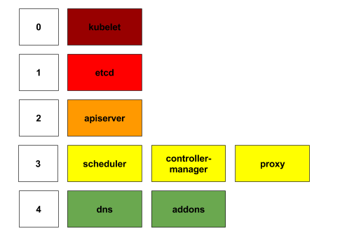
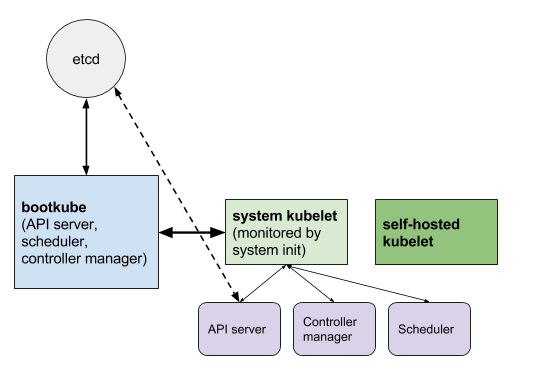
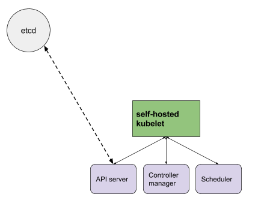

# Proposal: Self-hosted Control Plane

Author: Brandon Philips <brandon.philips@coreos.com>

## Motivations

> Running our components in pods would solve many problems, which we'll otherwise need to implement other, less portable, more brittle solutions to, and doesn't require much that we don't need to do for other reasons. Full self-hosting is the eventual goal.
>
> - Brian Grant ([ref](https://github.com/kubernetes/kubernetes/issues/4090#issuecomment-74890508))

### What is self-hosted?

Self-hosted Kubernetes runs all required and optional components of a Kubernetes cluster on top of Kubernetes itself.

The advantages of a self-hosted Kubernetes cluster are:

1. **Small Dependencies:** self-hosted should reduce the number of components required, on host, for a Kubernetes cluster to be deployed to a Kubelet (ideally running in a container). This should greatly simplify the perceived complexity of Kubernetes installation.
2. **Deployment consistency:** self-hosted reduces the number of files that are written to disk or managed via configuration management or manual installation via SSH. Our hope is to reduce the number of moving parts relying on the host OS to make deployments consistent in all environments.
3. **Introspection:** internal components can be debugged and inspected by users using existing Kubernetes APIs like `kubectl logs`
4. **Cluster Upgrades:** Related to introspection the components of a Kubernetes cluster are now subject to control via Kubernetes APIs. Upgrades of Kubelet's are possible via new daemon sets, API servers can be upgraded using daemon sets and potentially deployments in the future, and flags of add-ons can be changed by updating deployments, etc.
5. **Easier Highly-Available Configurations:** Using Kubernetes APIs will make it easier to scale up and monitor an HA environment without complex external tooling. Because of the complexity of these configurations tools that create them without self-hosted often implement significant complex logic.

However, there is a spectrum of ways that a cluster can be self-hosted. To do this we are going to divide the Kubernetes cluster into a variety of layers beginning with the Kubelet (level 0) and going up to the add-ons (Level 4). A cluster can self-host all of these levels 0-4 or only partially self-host.

For example, a 0-4 self-hosted cluster means that the kubelet is a daemon set, the API server runs as a pod and is exposed as a service, and so on. While a 1-4 self-hosted cluster would have a system installed Kubelet.

## Practical Implementation Overview

This document outlines the current implementation of "self-hosted Kubernetes" installation and upgrade of Kubernetes clusters based on the work that the teams at CoreOS and Google have been doing. The work is motivated by the upstream "Self-hosted Proposal".

The entire system is working today and is used by Bootkube, a Kubernetes Incubator project, and all Tectonic clusters created since July 2016. This document outlines the implementation, not the experience. The experience goal is that users not know all of these details and instead get a working Kubernetes cluster out the other end that can be upgraded using the Kubernetes APIs.

The target audience of this document are others, like [kubeadm](https://github.com/kubernetes/kubernetes/pull/38407), thinking about and building the way forward for install and upgrade of Kubernetes. If you want a higher level demonstration of "Self-Hosted" and the value see this [video and blog](https://coreos.com/blog/self-hosted-kubernetes.html).

### Bootkube

Today, the first component of the installation of a self-hosted cluster is [`bootkube`](https://github.com/kubernetes-incubator/bootkube). Bootkube provides a temporary Kubernetes control plane that kicks tells a kubelet to execute all of the components necessary to run a full blown Kubernetes control plane. When the kubelet connects to this temporary API server it will deploy the required Kubernetes components, as pods. This diagram shows all of the moving parts:

Note: In the future this temporary control plane may be replaced with a kubelet API that will enable injection of this state directly into the kubelet without a temporary Kubernetes API server.

At the end of this process the bootkube can be shut down and the system kubelet will coordinate, through a POSIX lock, to let the self-hosted kubelet take over lifecycle and management of the control plane components. The final cluster state looks like this:

There are a few things to note. First, generally, the control components like the API server, etc will be pinned to a set of dedicated control nodes. For security policy, service discovery, and scaling reasons it is easiest to assume that control nodes will always exist on N nodes.

Another challenge is load balancing the API server. Bedrock for the API server will be DNS, TLS, and a load balancer that live off cluster and that load balancer will want to only healthcheck a handful of servers for the API server port liveness probe.

### Bootkube Challenges

This process has a number of moving parts. Most notably the hand off of control from the "host system" to the Kubernetes self-hosted system. And things can go wrong:

1) The self-hosted Kubelet is in a precarious position as there is no one around to restart the process if it crashes. The high level is that the system init system will watch for the Kubelet POSIX lock and start the system Kubelet if the lock is missing. Once the system Kubelet starts it will launch the self-hosted Kubelet.

2) Recovering from reboots of single-master installations is a challenge as the Kubelet won't have an API server to talk to to restart the self-hosted components. We are solving this today with "[user space checkpointing](https://github.com/kubernetes-incubator/bootkube/tree/master/cmd/checkpoint#checkpoint)" container in the Kubelet pod that will periodically check the pod manifests and persist them to the static pod manifest directory. Longer term we would like for the kubelet to be able to checkpoint itself without external code.

## Long Term Goals

Ideally bootkube disappears over time and is replaced by a [Kubelet pod API](https://github.com/kubernetes/kubernetes/issues/28138). The write API would enable an external installation program to setup the control plane of a self-hosted Kubernetes cluster without requiring an existing API server.

[Checkpointing](https://github.com/kubernetes/kubernetes/issues/489) is also required to make for a reliable system that can survive a number of normal operations like full down scenarios of the control plane. Today, we can sufficiently do checkpointing external of the Kubelet process, but checkpointing inside of the Kubelet would be ideal.

A simple updater can take care of helping users update from v1.3.0 to v1.3.1, etc over time.

### Self-hosted Cluster Upgrades

#### Kubelet upgrades

The kubelet could be upgraded in a very similar process to that outlined in the self-hosted proposal.

However, because of the challenges around the self-hosted Kubelet (see above) Tectonic currently has a 1-4 self-hosted cluster with an alternative Kubelet update scheme which side-steps the self-hosted Kubelet issues. First, a kubelet system service is launched that uses the [chrooted kubelet](https://github.com/kubernetes/community/pull/131) implemented by the [kubelet-wrapper](https://coreos.com/kubernetes/docs/latest/kubelet-wrapper.html). Then, when an update is required, a node annotation is made which is read by a long-running daemonset that updates the kubelet-wrapper configuration. This makes Kubelet versions updateable from the cluster API.

#### API Server, Scheduler, and Controller Manager

Upgrading these components is fairly straightforward. They are stateless, easily run in containers, and can be modeled as pods and services. Upgrades are simply a matter of deploying new versions, health checking them, and changing the service label selectors.

In HA configurations the API servers should be able to be upgraded in-place one-by-one and rely on external load balancing or client retries to recover from the temporary downtime. This relies on Kubernetes [versioning policy](https://github.com/kubernetes/community/blob/master/contributors/design-proposals/versioning.md).

#### etcd self-hosted

As the primary data store of Kubernetes etcd plays an important role. Today, etcd does not run on top of the self-hosted cluster. However, progress is being made with the introduction of the [etcd Operator](https://coreos.com/blog/introducing-the-etcd-operator.html) and integration into [bootkube](https://github.com/kubernetes-incubator/bootkube/blob/848cf581451425293031647b5754b528ec5bf2a0/cmd/bootkube/start.go#L37).

### Highly-available Clusters

Self-hosted will make operating highly-available clusters even easier. For internal critical components like the scheduler and controller manager, which already know how to leader elect using the Kubernetes leader election API, creating HA instances will be a simple matter of `kubectl scale` for most administrators. For the data store, etcd, the etcd Operator will ease much of the scaling concern.

However, the API server will be a slightly trickier matter for most deployments as the API server relies on either external load balancing or external DNS in most common HA configurations. But, with the addition of Kubernetes label metadata on the [Node API](https://github.com/kubernetes/kubernetes/pull/39112) self-hosted may make it easier for systems administrators to create glue code that finds the appropriate Node IPs and adds them to these external systems.

### Conclusions

Kubernetes self-hosted is working today. Bootkube is an implementation of the "temporary control plane" and this entire process has been used by [`bootkube`](https://github.com/kubernetes-incubator/bootkube) users and Tectonic since the Kubernetes v1.4 release. We are excited to give users a simpler installation flow and sustainable cluster lifecycle upgrade/management.

## Known Issues

- [Health check endpoints for components don't work correctly](https://github.com/kubernetes-incubator/bootkube/issues/64#issuecomment-228144345)
- [kubeadm doesn't do self-hosted yet](https://github.com/kubernetes/kubernetes/pull/38407)
